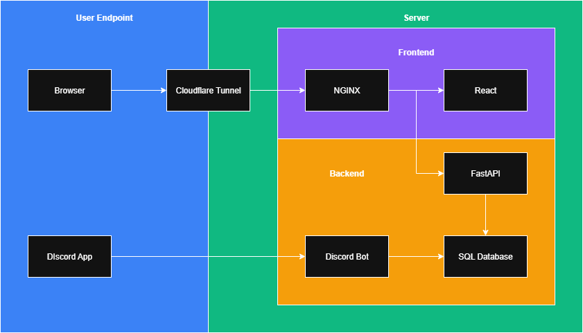

	<h1>Masa Meter [beta]</h1>

## Table of Contents
- [Overview](#overview)
- [Features](#features)
- [Technologies Used](#technologies-used)
- [Project Architecure](#project-architecture)
- [Contributors](#contributors)
- [License](#license)

## Overview
Masa Meter is Python web application that integrates with a Discord bot and provides a web dashboard. The bot increments a counter whenever someone says "Sushi Masa", and the website displays:
- Current counter
- History of mentions
- Leaderboard ranking
- Achievements
- Random sushi picture (from Pexels API)

This project demonstrates modern full-stack development with Python, FastAPI, Discord.py, HTML, CSS, TypeScript, React, SQLite3, NGINX, Docker, and Cloudflare tunneling.

## Features
- Interactive Discord bot that tracks mentions of "Sushi Masa" (manual)
- React web interface showing counter, history, leaderboard, achievements, and sushi picutres
- Integration with <a href="https://www.pexels.com/">Pexels</a> photo API
- Lightweight SQLite3 database
- NGINX reverse proxy
- Docker containerization and deployment
- Cloudflare Tunneling for secure public access from personal Raspberry Pi

## Technologies Used
- **Python 3.11** – Core language  
- **SQLite3** – Database  
- **FastAPI** – Web framework
- **Discord.py** – Discord bot framework
- **React** – Frontend 
- **Pexels API** - Stock sushi pictures API
- **Docker** – Containerization and deployment
- **Cloudflare Tunnel** – Expose local server securely to the public

## Project Architecture

## Contributors
<table>
  <tr>
    <th>Contributor</th>
    <th>Role</th>
    <th>GitHub</th>
  </tr>
  <tr>
    <td align="center"></td>
    <td align="center">Lead Developer</td>
    <td align="center"><a href="https://github.com/yellowcrystalz">@Yellowcrystalz</a></td>
  </tr>
  <tr>
    <td align="center"></td>
    <td align="center">Developer</td>
    <td align="center"><a href="https://github.com/dann-do">@dann-do</a></td>
  </tr>
  <tr>
    <td align="center"></td>
    <td align="center">Artist</td>
    <td align="center"><a href="https://github.com/RyujinKanao">@RyujinKanao</a></td>
  </tr>
  <tr>
    <td align="center"></td>
    <td align="center">Web Designer</td>
    <td align="center"><a href="https://github.com/GracefulTania">@GracefulTania</a></td>
  </tr>
</table>

## License
This project is licensed under the MIT License. See [LICENSE](LICENSE) for details.